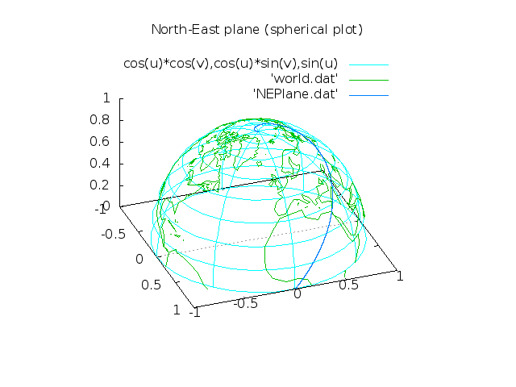

The North-Eastern Plane!
========================

A small simulation in Python computing the trajectory of a plane going always north-eastern direction, at constant speed.
    
In theory, it does an infinite number of rounds around the north pole before reaching it, but in finite time, for a finite total distance!
The central acceleration is also predicted to become infinite, precisely when the plane reaches the pole!
